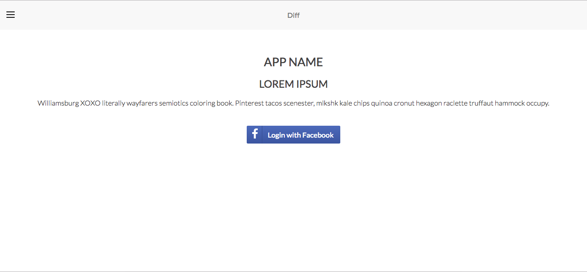
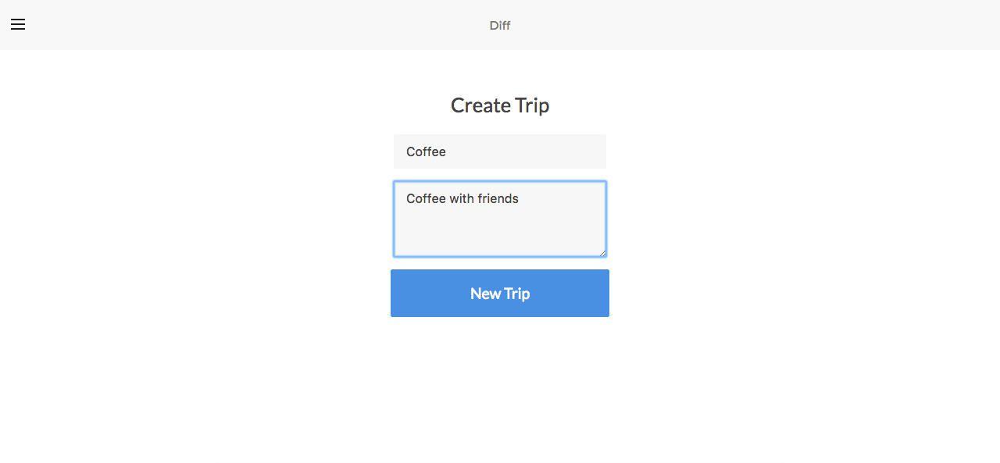
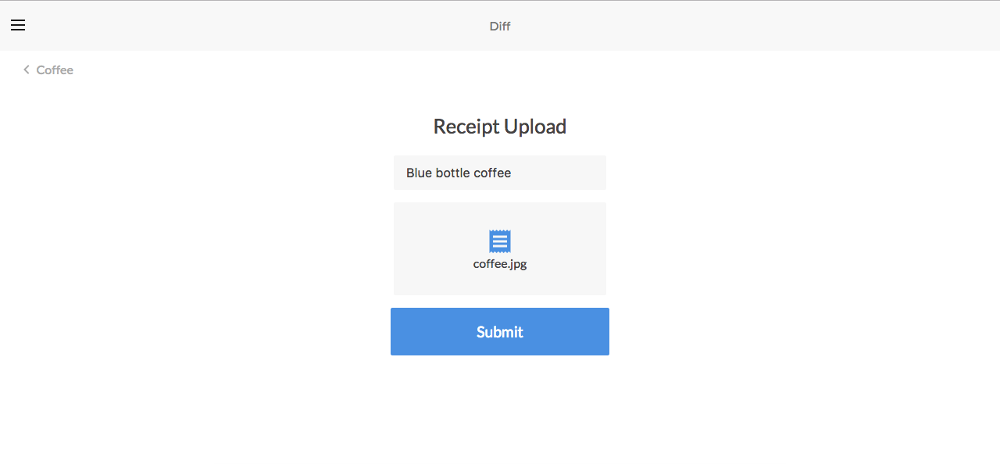
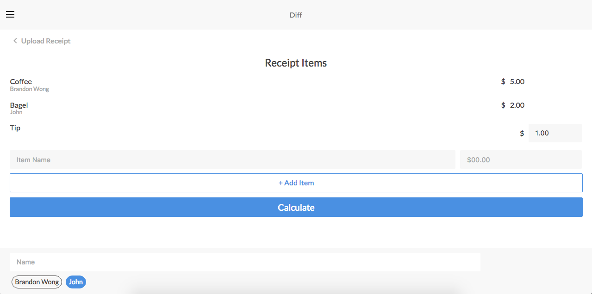
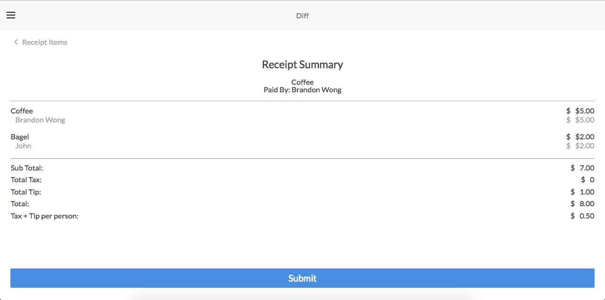
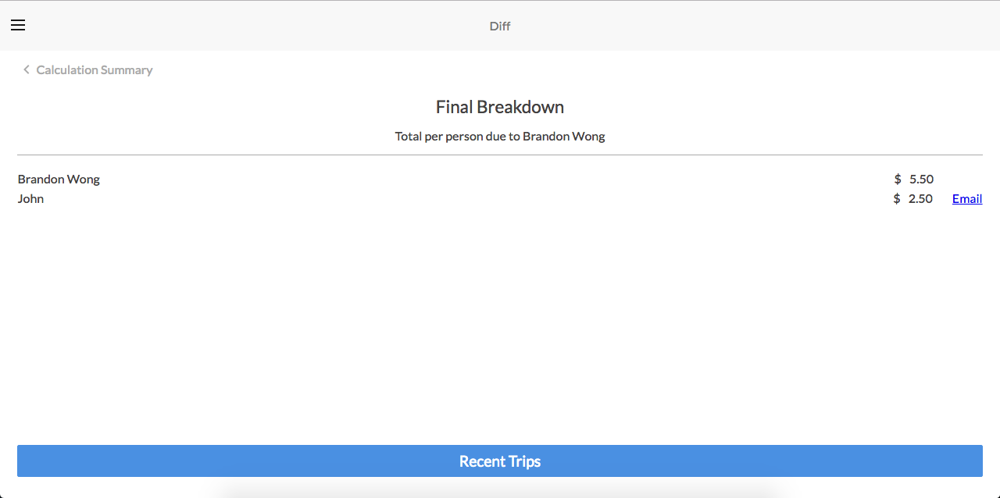

# The Project

An application for bill splitting and tracking with

Diff is an application for dividing your bills and receipts with your friends. It utilizes PassportJS for authentication, and you can take a picture of your receipt where Google Vision API will parse the breakdown of your receipt. Using an algorithm, you can add your friends to items and it will take you to a breakdown summary of what is owed. You can e-mail your friends with the MailGun API to remind them of how much they owe. You can add them to your friends list for easy bill collaboration. You can also view your recently added trips at a later time.

Create your trip
:----------------------------------------------------------------------------------------------------:

Upload your receipt
:----------------------------------------------------------------------------------------------------:

Add friends to bill
:----------------------------------------------------------------------------------------------------:

View receipt summary
:----------------------------------------------------------------------------------------------------:

Submit final breakdown
:----------------------------------------------------------------------------------------------------:

## Team

  - Brandon Wong
  - Kai Yu
  - Tayo Jolaosho

## Table of Contents

1. [Usage](#Usage)
1. [Requirements](#requirements)
1. [Development](#development)
    1. [Installing Dependencies](#installing-dependencies)
    1. [Tasks](#tasks)
1. [Roadmap](#roadmap)
1. [Contributing](#contributing)

## Usage

> Run npm start and npm webpack;
> mysql -u root < schema.sql; schema is available in server/db-mysql

## Requirements

- Node 6.4.x
- Express
- React
- MYSQL

- API key setup required:
	GOOGLE VISION API: https://cloud.google.com/vision/
	>Insert Google Vision API parameters in server/api/vision.js
	Cloudinary API: http://cloudinary.com/
	>Insert Cloudinary API parameters in server/index.js
## Development

### Installing Dependencies

From within the root directory:

npm install
